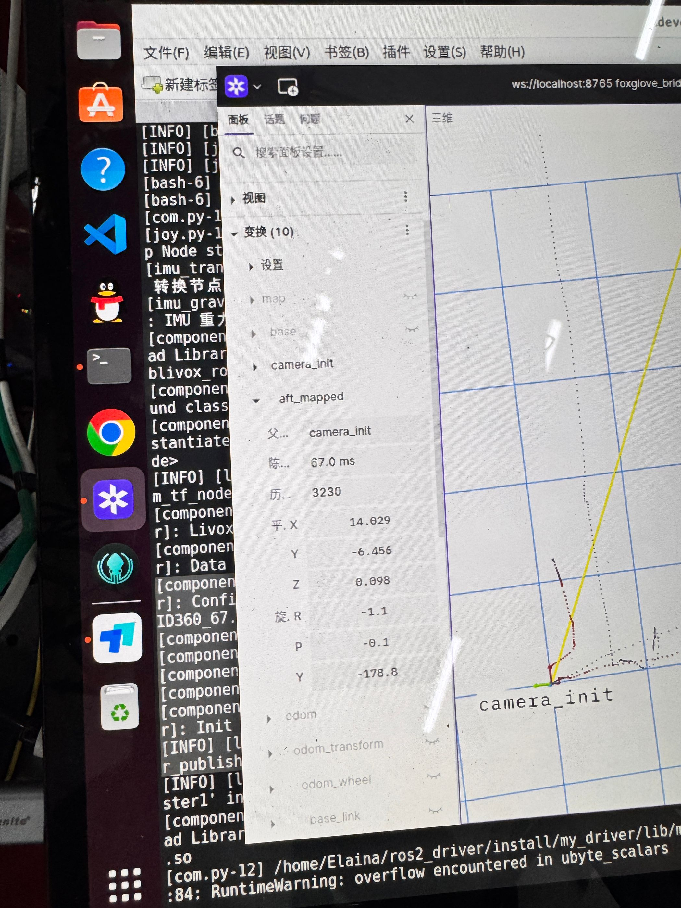
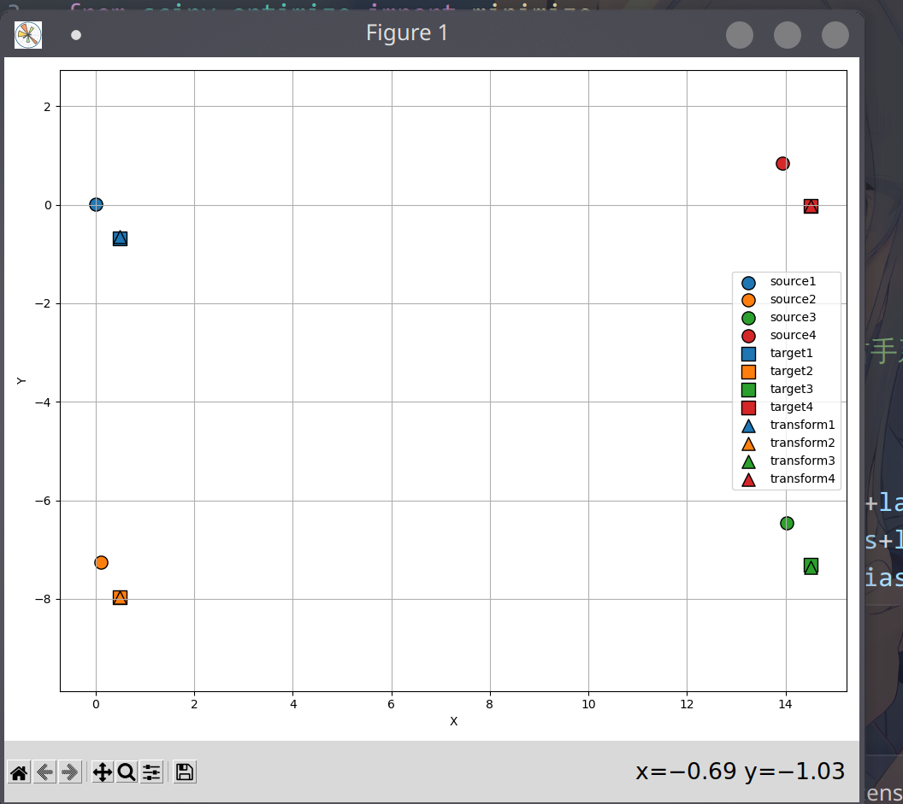
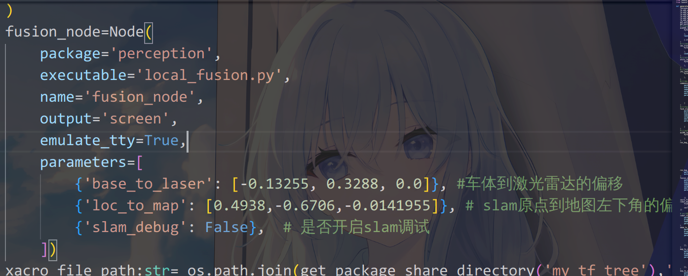

# 重定位使用教程
## 1.获得先验地图
-  确保map里面没有地图
-  执行下面的代码
```bash
.devcontainer docker compose -f ./map.yaml up
```
- 尽量能保存所有出发点的位姿
> tips: 重定位是基于关键帧的,与位姿强相关
## 2.进行标定
- 先验地图的原点和你的地图原点不是同一个原点,在robocon2025中假设地图左下角为原点
- 将理论值与真实值拖入标定程序,在visual_2025仓库my_perception/scripts/icp.py

- 标定结果如下

## 3.将标定结果填入启动的launch 


## 3.slam的坑
- 雷达安装包位置不在车体的旋转中心会导致旋转x y 发生改变,也会改变初始点(yaw不能严格对齐)
- 雷达基本没有累计误差,但是初始点yaw误差会导致加大的y误差
```txt
假设初始点没放准0.5°在前进十米时候y的误差为10*sin(0.5)=9cm
```
- 2025赛季方法,用磨墙算出初始点与安装误差,同时加到slam全局坐标系与雷达到车体中心的局部坐标系中
> 这里的安装误差需要在一开始就加到两个坐标系