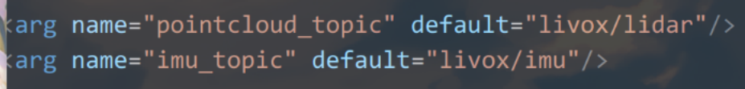
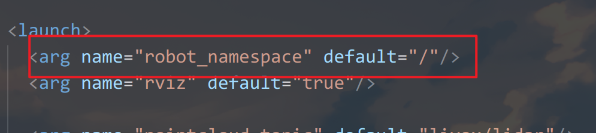

### 运行最低要求
- 1.提供点云数据,格式为pointcloud2没有timestamp,ring的要求
- 2.提供imu数据,默认与雷达同一个坐标系
- 3.连接到容器的终端后用roslaunch dio_slam dlo_run.launch启动
话题名对应dlo_run.launch的两个参数

### 注意事项
- 1.在launch文件的最开头有一个namespace参数
它会在话题以及节点的前面加一个前缀

- 2.在原始的项目中启动时候会打开一个rviz但是显示的都是带有/robot前缀的内容
不会有任何东西,所以在launch关掉

### [官方仓库链接](https://github.com/vectr-ucla/direct_lidar_odometry)