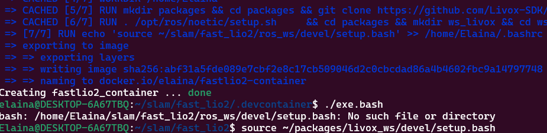
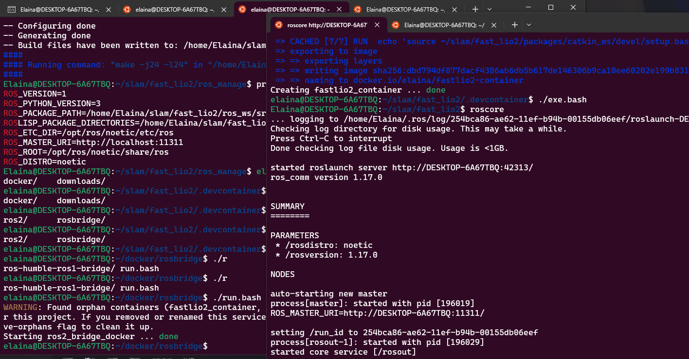

<div align="center">
<h1>lio_sam模块</h1>
</div>

## 维护者
- nagisa 
- QQ：2964793117

## 仓库介绍
- 此模利用mid360与Imu进行3d点云建图

## 使用教程
### 1.进入docker[详细方法链接](https://github.com/njustup70/docker)
### 下面的错误可以忽略，当编译过自己的包后就不会有问题了


### 2.启动ros1_bridge与roscore
- 1.roscore
```bash
roscore
```
- 2.启动ros1_bridge [链接](https://github.com/njustup70/docker/tree/master/rosbridge)
```bash
PATH TO rosbridge$./run.bash
```

- 左边为rosbridge右边为roscore

### 3.使用方法
- 1.构建容器
```bash
~/slam_docker/lio_sam/.devcontainer$ docker-compose up --b
```
- 2.进入容器
```bash
~/slam_docker/lio_sam/.devcontainer$ docker-compose up --d && docker exec -it lio_sam_container bash 
```
- 3.source步骤（已解决）
```bash
~/packages/lio_sam/ros_manager$ source devel/setup.bash
```
- 4.运行lio_sam
```bash
~/packages/lio_sam/nagisa_ws$ roslaunch my_lio_sam run.launch
```
## 注释部分

### 1.注意事项:上面的三个步骤一定一定按顺序执行，不然会出现ROS 的source 覆盖问题

### 2.source解决办法(nagisa's version):
- ros1下存在catkin_make的定格问题，会导致不同工作空间之间的source出现冲突找不到功能包的问题
- 构建一个永不再编译的，专门管理source的新工作空间，在新增工作空间时仅需修改管理空间的devel/_setup_util.py文件即可。[原帖链接](https://immortalqx.github.io/2021/07/17/ros-notes-3/)

### 3.bug warning: 
- docker中将用户组抽象为个人基础镜像的想法不是一个好的想法，dockerfile中的uid和主机里的uid需要相符才能够解决权限问题（要么就将权限开放给所有用户），否则进入容器后会大量报错permission denied。

## 写给实机部署的开发者的容器联合开发
- 1.本容器开启roscore
- 2.本容器下载[官网数据集](https://drive.google.com/drive/folders/1gJHwfdHCRdjP7vuT556pv8atqrCJPbUq)并运行(在后源码链接中的官方包README中还有更多数据集合)
- 3.按照前述方法运行lio_sam


## 源码连接
### [LIO-SAM](https://github.com/TixiaoShan/LIO-SAM)
 - 官方仓库